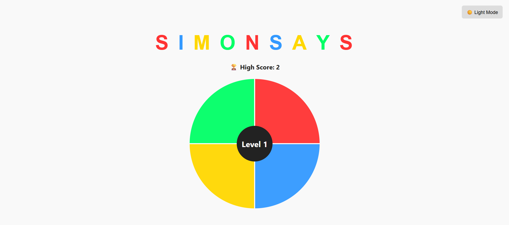
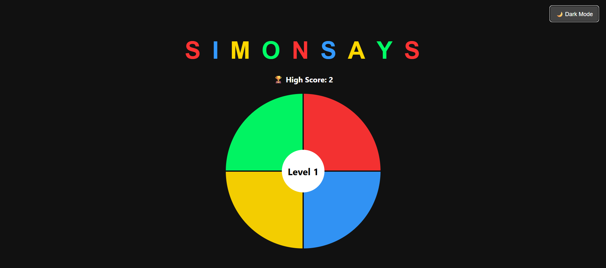

# Simon Says Game

A classic Simon Says memory game built with HTML, CSS, and JavaScript, featuring a clean user interface, dark/light mode toggle, sound effects, and a high score tracker. This is a single-player game where the user must watch and repeat the sequence of colors shown. With each level, the sequence gets longer, testing your memory and attention. The game includes an elegant UI, theme customization, and feedback sounds to enhance the gaming experience.

## Table of Contents
- [Features](#features)
- [Screenshots](#screenshots)
- [Tech Stack](#tech-stack)
- [Setup Instructions](#setup-instructions)
- [Usage](#usage)
- [Contributing](#contributing)
- [License](#license)

## Features
* **Memory Sequence Gameplay:** Repeat the exact sequence of color flashes.
* **High Score Tracker:** Automatically records your highest level using localStorage.
* **Dark/Light Mode Toggle:** Switch between dark and light themes for visual comfort.
* **Sound Effects:**
    * Click sound for each button press.
    * Error sound when the wrong button is clicked.
* **Responsive Design:** Fully playable on desktop and mobile screens.

## Screenshots
| Light Mode (In-Game) | Dark Mode (In-Game) | Game Over |
| :------------------: | :-----------------: | :-------: |
|  |  |  |

## Tech Stack
* **HTML:** For the structure of the game.
* **CSS:** For styling, themes, and responsive layout.
* **JavaScript:** For game logic, animations, sound control, and theme handling.

## Setup Instructions

To get a copy of this project up and running on your local machine, follow these simple steps:

1.  **Clone the repository:**
    ```bash
    git clone https://github.com/your-username/Simon-Says-Game.git
    cd Simon-Says-Game
    ```
2.  **Download the project files:**
    Ensure you have the following files in a single directory:
    * `index.html`
    * `style.css`
    * `script.js`
    * `click.mp3`
    * `wrong.mp3`

3.  **Open `index.html`:**
    Simply open the `index.html` file in your preferred web browser. You can do this by:
    * Double-clicking the `index.html` file.
    * Right-clicking `index.html` and choosing "Open with" → your web browser (e.g., Chrome, Firefox, Edge).

## Usage
Once you open `index.html` in your browser:
1.  Click the center **Start** button to begin.
2.  Observe the color sequence that flashes.
3.  Repeat the exact sequence by clicking the same colored buttons in the same order.
4.  With each level, the sequence gets longer.
5.  If you make a mistake, the game ends and shows a **Game Over** message.
6.  Your highest level will be recorded and displayed as your **High Score**.
7.  Click the center button again to restart the game.
8.  Use the "Dark Mode" toggle in the top right corner to switch themes.

## Contributing
Contributions are welcome! If you have any suggestions, bug fixes, or new features to add, please feel free to:
1.  Fork the repository.
2.  Create a new branch (`git checkout -b feature/YourFeatureName`).
3.  Make your changes.
4.  Commit your changes (`git commit -m 'Add some feature'`).
5.  Push to the branch (`git push origin feature/YourFeatureName`).
6.  Open a Pull Request.

## Live Demo

Play the game live: [Simon Says Game](https://simon-says-kartikk.vercel.app/)  

## License
This project is open source and available under the [MIT License](LICENSE).