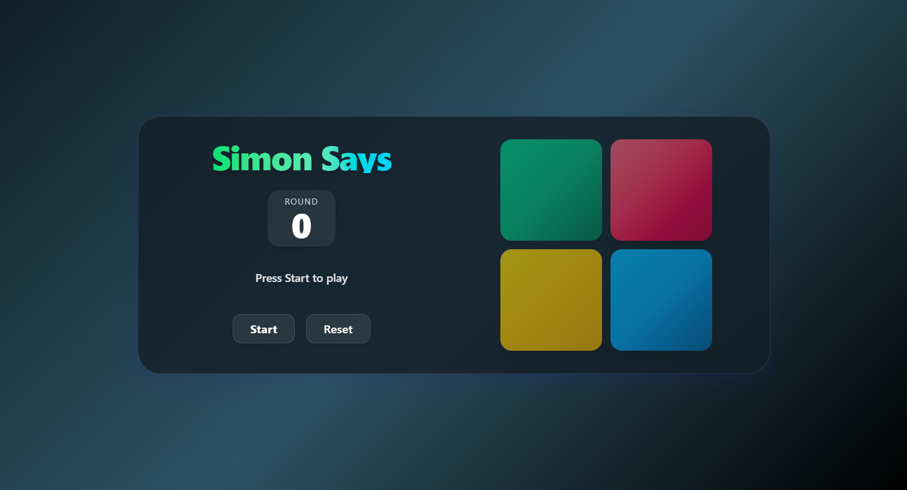

# 🎯 SimonSays - Memory Game Web App

A beautiful, interactive web application that challenges your memory by repeating color sequences. Enjoy a modern UI, smooth animations, and theme switching between dark and light modes.

---

## 📋 Table of Contents

- [Features](#-features)
- [Gameplay](#-gameplay)
- [Technical Details](#-technical-details)
- [Run Instructions](#-run-instructions)
- [Technologies Used](#️-technologies-used)
- [Author](#-author)
- [Screenshots](#-screenshots)

---

## 🌟 Features

- **Interactive Gameplay**
  - Classic Simon Says memory challenge
  - Responsive tile interactions and animations
  - Real-time feedback on correct/wrong moves

- **Modern UI**
  - Glassmorphism cards and scoreboard
  - Vibrant color gradients and glowing effects
  - Professional, accessible design

- **Theme Support**
  - Toggle between dark and light modes
  - Smooth transitions and consistent color palette

- **User Controls**
  - Start, reset, and continue game
  - Visual feedback for game over and next round

---

## 🎮 Gameplay

- Watch the sequence of colored tiles.
- Repeat the sequence by clicking the tiles in order.
- Each round adds a new tile to the sequence.
- The game ends when you make a mistake—try to beat your highest round!

---

## 🔧 Technical Details

- **Responsive Design**
  - Works on all screen sizes
  - Touch-friendly controls
  - Fluid animations

- **Performance Optimized**
  - Efficient React state management
  - Smooth transitions and effects

---

## 💻 Run Instructions

1. Clone the repository:
   ```bash
   git clone https://github.com/kartikkkandpal/SimonSays.git
   cd SimonSays
   ```

2. Install dependencies and start the app:
   ```bash
   npm install
   npm run dev
   ```
3. Open Link in Your Browser:
   ```bash
   http://localhost:5173=
   ```
---

## 🛠️ Technologies Used

- **Frontend**
  - React
  - Tailwind CSS
  - Modern CSS (Glassmorphism, gradients, transitions)
  - Vite

---

## 👤 Author

- [Kartik Kandpal](https://github.com/kartikkkandpal)

---

## 🖼️ Screenshots


---

Test your memory and enjoy a beautiful, modern Simon Says experience!
